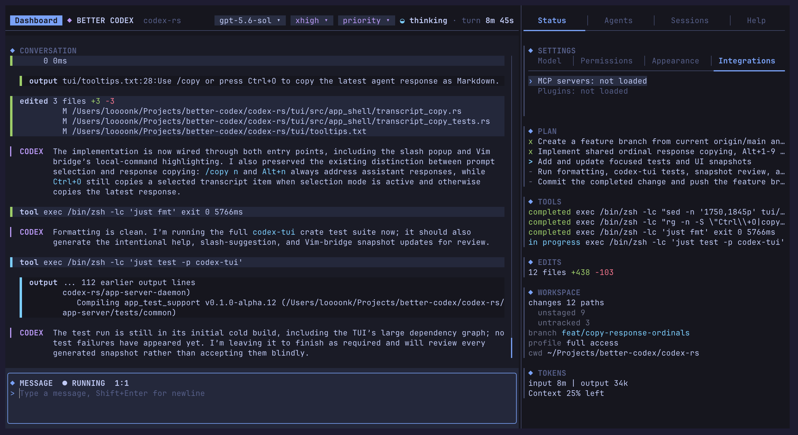
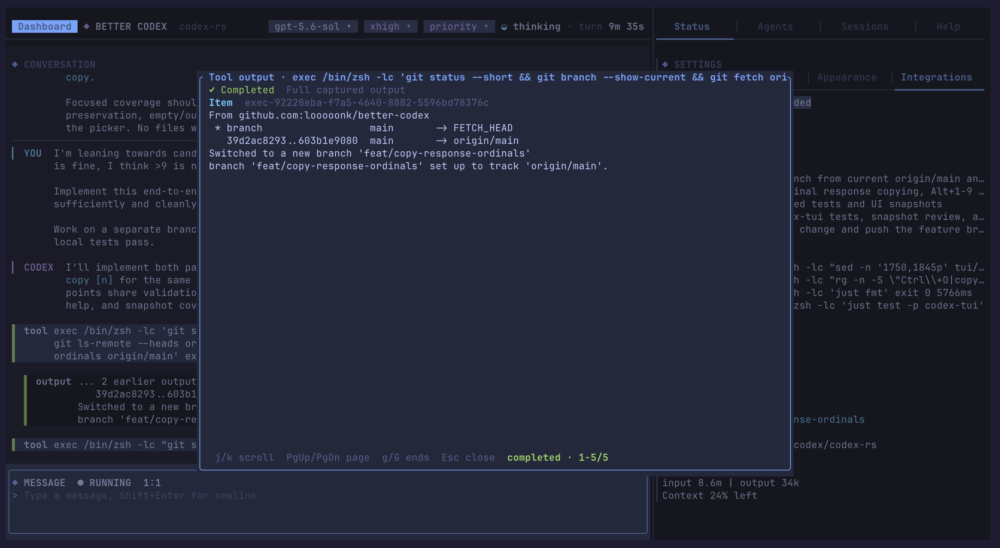
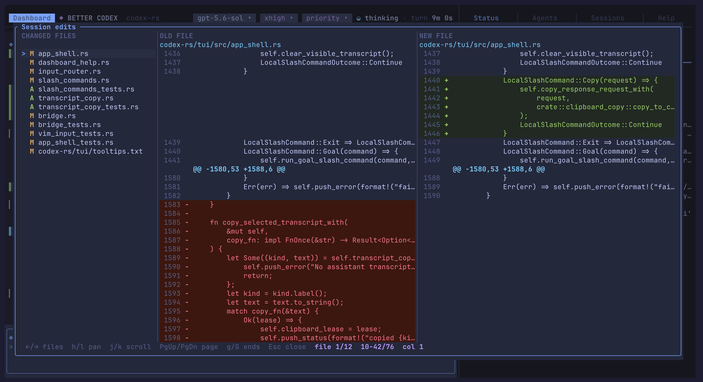

<div align="center">

# Better Codex

**A full-screen terminal workspace for Codex.**

Run agents, inspect tools, review edits, and manage every coding session without
leaving your terminal.

[](https://github.com/looooonk/better-codex/releases)
[](#system-requirements)
[](LICENSE)
[](https://www.rust-lang.org/)

[Install](#install) · [Features](#everything-in-one-workspace) ·
[Documentation](#documentation) · [Contribute](CONTRIBUTING.md)

</div>



Better Codex reshapes the Codex Rust backend into a dense, app-like TUI. Instead
of dropping directly into a single chat, it gives you a dashboard for starting,
finding, and resuming work, plus a session view where the conversation, active
tools, agent plan, file changes, and project status stay visible together.

> [!NOTE]
> Better Codex is an actively developed, installable alpha. It is a standalone
> community fork and is not a drop-in replacement for the upstream Codex CLI.

## Install

Install the latest release on macOS or Linux, then launch it from any project:

```sh
curl -fsSL https://raw.githubusercontent.com/looooonk/better-codex/main/scripts/install.sh | sh
cd path/to/your/project
better-codex
```

The installer selects the correct release for your platform, verifies its
SHA-256 checksum, and places the `better-codex` launcher in
`$HOME/.local/bin`. If that directory is not already on your `PATH`, the
installer tells you before you try to launch the app.

On first launch, choose ChatGPT sign-in or OpenAI API-key authentication, then
start a session from the dashboard.

> [!IMPORTANT]
> macOS release binaries are not code-signed yet. The first launch may require
> approval in **System Settings > Privacy & Security**.

### System requirements

| Platform | Supported releases                                      | Architectures           |
| -------- | ------------------------------------------------------- | ----------------------- |
| macOS    | macOS 12 and newer                                      | Apple Silicon and Intel |
| Linux    | Ubuntu 20.04+, Debian 10+, and compatible distributions | ARM64 and x86_64        |

Git is optional but recommended for the built-in repository and review
features. Native Windows and WSL are not currently supported.

<details>
<summary><strong>Install a specific version</strong></summary>

```sh
curl -fsSL https://raw.githubusercontent.com/looooonk/better-codex/main/scripts/install.sh \
  | sh -s -- --version 0.1.0-alpha.14
```

Browse every published build on the
[Releases page](https://github.com/looooonk/better-codex/releases).

</details>

<details>
<summary><strong>Build from source</strong></summary>

Install Rust through [rustup](https://rustup.rs/), plus Git, CMake, a C/C++
compiler, and `pkg-config`. Linux builds also require `bubblewrap`.

```sh
git clone https://github.com/looooonk/better-codex.git
cd better-codex/codex-rs
cargo build --release -p codex-cli --bin codex
cargo build --release -p codex-code-mode-host --bin codex-code-mode-host
mkdir -p "$HOME/.local/bin"
install -m 755 target/release/codex "$HOME/.local/bin/better-codex"
install -m 755 target/release/codex-code-mode-host "$HOME/.local/bin/codex-code-mode-host"
```

The workspace pins its Rust toolchain, so `rustup` selects the expected version
automatically. See the [complete build guide](docs/install.md) for development
tools, test commands, and logging.

</details>

## Everything in one workspace

|                            |                                                                                                                 |
| -------------------------- | --------------------------------------------------------------------------------------------------------------- |
| **Session-first workflow** | Create, search, resume, fork, rename, archive, and delete sessions from one dashboard.                          |
| **Live execution**         | Follow streaming responses and tool output while the agent works, with long results available in focused views. |
| **Built-in review**        | Inspect the complete edit set in a navigable, side-by-side diff before accepting the result.                    |
| **Visible agent state**    | Keep the plan, running tools, workspace changes, token usage, model, and reasoning effort in view.              |
| **Practical controls**     | Change models, permissions, appearance, authentication, and service tier without leaving the TUI.               |
| **Extensible backend**     | Use MCP servers, plugins, skills, goals, and connected app-server or exec-server deployments.                   |

GPT-6 Astra is available through the model picker, with reasoning from Low to
Ultra and Fast service when supported by your account. Astra can ask questions
in the conversation while continuing its work; reply through the normal message
composer, using a suggested answer or your own text.

<table>
  <tr>
    <td width="50%">
      <a href=".github/assets/tool-result.png"></a>
    </td>
    <td width="50%">
      <a href=".github/assets/file-diff.png"></a>
    </td>
  </tr>
  <tr>
    <td><strong>Stay on top of tools.</strong> Open a focused result viewer for commands and other agent activity without losing the surrounding conversation.</td>
    <td><strong>Review the whole change.</strong> Move between changed files and inspect additions and removals in a full-screen diff.</td>
  </tr>
</table>

## A quick tour

Running `better-codex` opens the dashboard. Start a new session or resume an
existing one, type a request in the composer, and follow the work in the main
conversation pane. The right side of the workspace keeps status, agents,
sessions, help, settings, plan progress, tools, edits, and token usage close at
hand.

Useful controls to get started:

| Input                   | Action                                      |
| ----------------------- | ------------------------------------------- |
| `Enter`                 | Open the selected item or submit a message  |
| `Shift+Enter`           | Add a new line in the composer              |
| `Ctrl+D`                | Hide the dashboard or bring it back         |
| `!<command>`            | Run a local shell command from the composer |
| `Esc` or `Ctrl+C` twice | Exit Better Codex                           |

Contextual shortcuts are always shown along the bottom edge of focused views,
so you do not need to memorize the full key map.

## Updates

Managed installs check for new releases on startup and offer to update in place.
You can also update directly from the command line:

```sh
better-codex update
```

Rerunning the installer works too. Either path activates the new verified
release while keeping the launcher path stable.

## Documentation

- [Documentation index](docs/README.md)
- [Getting started](docs/getting-started.md)
- [Installation and development setup](docs/install.md)
- [Configuration](docs/config.md)
- [Authentication](docs/authentication.md)
- [Sandboxing and approvals](docs/sandbox.md)
- [Skills](docs/skills.md)
- [Slash commands](docs/slash_commands.md)
- [Repository guide for contributors](docs/repository-guide.md)

## Community

Bug reports, feature ideas, documentation improvements, and focused pull
requests are welcome. If something is not working, check the
[existing issues](https://github.com/looooonk/better-codex/issues) and then
[open a report](https://github.com/looooonk/better-codex/issues/new/choose).
For larger changes, please start with an issue so the approach can be discussed
before implementation.

Read [CONTRIBUTING.md](CONTRIBUTING.md) for the development workflow and review
expectations.

## Project relationship

Better Codex is built on the open-source
[Codex CLI](https://github.com/openai/codex) Rust backend, which remains useful
backend infrastructure and reference material. This fork is independently
developed around its own full-screen terminal experience and release path; it
is not an official OpenAI product.

## License

Licensed under [Apache-2.0](LICENSE). Better Codex retains the notices required
by the upstream project.
